<div align="center">


# Heirloom

**Every AI is amnesiac. Heirloom gives them yours.**

A local-first, MCP-native personal memory layer for AI. One install, then every MCP-aware AI tool — Claude, Cursor, Antigravity, OpenClaw, ChatGPT, custom agents — suddenly knows you.

[](https://github.com/heirloom-dev/heirloom/actions/workflows/ci.yml)
[](LICENSE)
[](https://modelcontextprotocol.io)
[](https://www.rust-lang.org/)
[](docs/design/sync-protocol.md)

</div>

<p align="center">
  
</p>

---

Every AI tool you use has its own siloed, half-broken memory. You re-explain yourself every conversation. You switch tools and lose months of context. The closed alternatives ([Rewind](https://rewind.ai), [Microsoft Recall](https://www.microsoft.com/en-us/windows/copilot-plus-pcs)) ship your life to someone else's server. The "claude-mem" cluster locks you to Claude Code and usually needs npm, Python, or external services like Chroma or Supabase.

Heirloom is a single Rust binary that ingests what *you* let it (notes, browser history, AI conversations, Slack and Obsidian exports), stores it locally in an encrypted SQLite database, and exposes it over [**MCP**](https://modelcontextprotocol.io) so any AI can ask: *"what does the user know about this?"*

Your memory is a file you own. Not a SaaS account.

## Why Heirloom over the alternatives?

| | **Heirloom** | claude-mem | claude-brain | claude-memory | Rewind / Recall |
|---|---|---|---|---|---|
| Works with any MCP client (Claude, Cursor, Antigravity, OpenClaw, …) | ✅ | ❌ Claude Code only | ❌ Claude Code only | ❌ Claude Code only | ❌ Single app |
| Single binary, no runtime | ✅ Rust | ❌ Needs npm + worker | ✅ Rust | ❌ Needs npm | ✅ |
| No API keys required | ✅ | ❌ LLM for compression | ✅ | ❌ Supabase | ❌ |
| Local-first by default | ✅ | Partial (Chroma) | ✅ | ❌ Cloud sync | ❌ |
| At-rest encryption | ✅ XChaCha20-Poly1305 / Argon2id | ❌ | ❌ | ❌ | ✅ |
| Hybrid lexical + vector search | ✅ BM25 + n-gram TF-IDF | ✅ | Lexical only | ✅ | ✅ |
| 8 built-in source ingesters | ✅ | ❌ AI sessions only | ❌ | ❌ AI sessions only | ✅ |
| Web viewer included | ✅ `localhost:7878` | ✅ | ❌ | ❌ | ✅ |
| Auto-capture daemon | ✅ `heirloom watch` | ✅ hooks | ❌ | ✅ hooks | ✅ |
| Pluggable ingester architecture | ✅ ~50-line plugins | ❌ | ❌ | ❌ | ❌ |
| Encrypted multi-device sync | ✅ client + protocol shipped | ❌ | ❌ | ✅ Supabase | ❌ |
| **Self-hostable team-memory server** | ✅ **`heirloom-team-server`** | ❌ | ❌ | ❌ | ❌ |
| Open source | ✅ MIT | ✅ Apache | ✅ | ✅ MIT | ❌ |

## Quickstart

```bash
curl -sSL https://heirloom.web.app/install | sh
heirloom init

# Ingest something
heirloom ingest fs --path ~/Documents/notes
heirloom ingest browser            # auto-detects Chrome/Brave/Arc/Edge/Vivaldi
heirloom ingest firefox            # places.sqlite history
heirloom ingest claude-code        # ~/.claude/projects/ sessions

# Try it
heirloom search "what was that auth bug"

# Open the dashboard
heirloom desktop
```

Then plug it into the AI client of your choice — same shape for all of them, full [docs/INTEGRATIONS.md](docs/INTEGRATIONS.md):

<details>
<summary><b>Claude Desktop</b></summary>

```json
{
  "mcpServers": {
    "heirloom": { "command": "heirloom", "args": ["serve"] }
  }
}
```

</details>

<details>
<summary><b>Cursor</b></summary>

`Settings → MCP → Add new MCP server` — same JSON shape.

</details>

<details>
<summary><b>Google Antigravity</b></summary>

`Settings → Customizations → Open MCP Config` — paste the same snippet. Works alongside Antigravity's MCP store. See [`examples/mcp-antigravity.json`](examples/mcp-antigravity.json).

</details>

<details>
<summary><b>OpenClaw</b></summary>

```bash
openclaw mcp add heirloom --command heirloom --args serve
```

Or drop [`examples/mcp-openclaw.json`](examples/mcp-openclaw.json) into your workspace `mcp.json`.

</details>

<details>
<summary><b>Claude Code, Continue, Cline, Zed, Windsurf, custom agents</b></summary>

Every MCP-aware client uses the same shape. See [docs/INTEGRATIONS.md](docs/INTEGRATIONS.md) for per-client tweaks.

</details>

Restart your client. Ask it something about your past. Watch it answer.

## Ingesters

| Name | Status | Description |
|---|---|---|
| `fs` | ✅ shipped | `.md` / `.txt` / `.rst` / `.org` files |
| `browser` | ✅ shipped | Chrome / Brave / Arc / Edge / Vivaldi history (safe temp-copy read) |
| `firefox` | ✅ shipped | Firefox `places.sqlite` history |
| `claude` | ✅ shipped | Claude `conversations.json` export |
| `chatgpt` | ✅ shipped | ChatGPT `conversations.json` export |
| `claude-code` | ✅ shipped | Claude Code session transcripts |
| `slack` | ✅ shipped | Slack workspace export (point at the unzipped directory) |
| `obsidian` | ✅ shipped | Obsidian vault with frontmatter + wikilink metadata |
| `antigravity` | 💡 wanted | Antigravity Manager-view artifacts |
| `linear` | 💡 wanted | Linear issues + comments |
| `apple-notes` | 💡 wanted | Apple Notes via JXA |
| `kindle` | 💡 wanted | Kindle highlights + clippings |
| `spotify` | 💡 wanted | Listening history |
| `strava` | 💡 wanted | Workouts |
| `letterboxd` | 💡 wanted | Films watched + reviews |

Build your own in ~50 lines — see [CONTRIBUTING.md](CONTRIBUTING.md) and copy `crates/ingesters/heirloom-fs` as a template.

## Encryption at rest

Heirloom uses **XChaCha20-Poly1305** authenticated encryption with an **Argon2id**-derived key (m=64 MiB, t=3, p=1) for the at-rest format.

```bash
HEIRLOOM_PASSPHRASE='correct horse battery staple' heirloom seal
# heirloom.db is now heirloom.db.hlm (encrypted) and the plaintext is shredded

HEIRLOOM_PASSPHRASE='correct horse battery staple' heirloom unseal
# back to a working plaintext heirloom.db
```

SQLite needs random access, so Heirloom can't run with the file encrypted live. The `seal` / `unseal` workflow gives you real protection against offline attackers while keeping search latency at SQLite speed. See [SECURITY.md](SECURITY.md) for the full threat model.

## Hybrid search

Pure FTS5 misses morphological variants (`postgres` ≠ `postgresql`, `auth` ≠ `authentication`). Pure transformer embeddings need ~80 MB of model + ONNX runtime. Heirloom ships a middle ground:

- **BM25** for exact-keyword recall (from SQLite FTS5).
- **Hash-projected n-gram TF-IDF vectors** for morphological + lexical similarity. Pure Rust, zero external models, embedded in the binary.

The `Embedder` trait in `heirloom-vector` is the seam — a future feature flag will let you swap in a `fastembed-rs` BERT-quality backend if you want transformer-grade recall and don't mind the deps.

## Heirloom Teams — shared memory for your organization

For organizations that want to pool memories across team members, the v1.0 release ships **`heirloom-team-server`** — a self-hostable Rust binary you deploy on your own infrastructure. No SaaS account. No cloud lock-in. Your team's memories live on your hardware.

```bash
# On the server
heirloom-team-server admin init --team-name "Acme Engineering"
# → prints a bootstrap admin token

heirloom-team-server --addr 0.0.0.0:7900
# → server is up
```

```bash
# On each member's machine
heirloom team join http://team.acme.internal:7900 --token hlmt_…
heirloom team sync         # push your shareable memories, pull the team's
```

Highlights:

- **Bearer-token authentication.** Tokens are server-generated, scoped per member, revokable. Members never share tokens.
- **End-to-end encrypted.** Memories are sealed client-side with the team passphrase before upload. The server stores only ciphertext.
- **Comprehensive audit log.** Every read, write, and delete is recorded by actor, IP, and timestamp.
- **Role-based access.** Admin / Member / Read-only.
- **SQLite-backed.** Single binary, zero external services. Scales to several million memories without breaking a sweat.

What's deferred to v1.1: OIDC/SAML SSO, Postgres backend for huge orgs, per-source ACLs. The current bearer-token model is the right honest tradeoff for v1.0 — many small orgs prefer it anyway. Architecture spec at [`docs/design/teams-architecture.md`](docs/design/teams-architecture.md).

## Multi-device sync

Single-user sync across your own machines uses the same `.hlm v1` envelope:

```bash
heirloom sync status                                          # show device id + relay config
heirloom sync set-relay https://relay.heirloom.web.app        # configure a relay
HEIRLOOM_PASSPHRASE='...' heirloom sync push                  # produce an encrypted snapshot
```

End-to-end encryption: the relay never sees plaintext. Protocol spec in [`docs/design/sync-protocol.md`](docs/design/sync-protocol.md). The reference relay is a ~150-line axum service over an object store — designed but not yet hosted. v0.1 produces snapshot files locally; copy between devices manually until the hosted relay ships.

## Web viewer & desktop

```
heirloom viewer     # local dashboard at http://127.0.0.1:7878
heirloom desktop    # same dashboard, opens in your default browser
```

Single embedded HTML file. Dark theme. Keyboard shortcuts. One-click redact. No JavaScript framework. No analytics. No telemetry.

## CLI

```
heirloom init                      Initialize a fresh memory store
heirloom add "..."                 Add a memory directly
heirloom ingest <name> [--path P]  Run an ingester
heirloom search "..." [-k N]       Search the store
heirloom recent [-s source]        Show newest memories
heirloom serve                     Start the MCP server on stdio
heirloom viewer [--addr A]         Start the local web viewer
heirloom desktop                   Open the viewer in your default browser
heirloom watch                     Start the auto-capture daemon
heirloom seal                      Encrypt the database file
heirloom unseal                    Decrypt the sealed database
heirloom sync {status,push,…}      Encrypted multi-device sync
heirloom export [-o FILE]          Export everything as JSONL
heirloom redact --id <uuid>        Hard-delete a memory
heirloom redact --query "..."      Delete every memory matching a query
heirloom status                    Counts by source
heirloom doctor                    Diagnose common issues

heirloom-team-server               (separate binary) self-host team memory
```

All commands accept `--json` for piping.

## Auto-capture

```toml
# ~/.heirloom/config.toml
[watch]
interval_minutes = 60

[[watch.tasks]]
ingester = "fs"
path = "/Users/me/Documents/notes"

[[watch.tasks]]
ingester = "browser"

[[watch.tasks]]
ingester = "claude-code"
```

Then `heirloom watch` and forget.

## Privacy & security

- **Local-first.** All data lives in `~/.heirloom/heirloom.db`. Nothing is uploaded by default.
- **At-rest encryption.** XChaCha20-Poly1305 + Argon2id.
- **No telemetry.** Heirloom does not phone home. Not even opt-in.
- **Opt-in per source.** Ingesters run only when you invoke them or list them in `config.toml`.
- **Redaction first.** Hard-delete via CLI or one-click in the viewer.
- **Viewer binds to loopback only.** No LAN exposure.
- **Team server is yours.** When you self-host `heirloom-team-server`, the bytes live on your hardware, with full audit logs.

If you find a security issue, please email `security@heirloom.web.app` rather than filing a public issue.

## Roadmap

- [x] **v0.1** — Core, MCP server, 5 ingesters, CLI, web viewer, watch daemon, export
- [x] **v0.2** — At-rest encryption, hybrid lexical+vector search, 3 more ingesters, desktop launcher, client-side sync pipeline
- [x] **v1.0** — Self-hostable Heirloom Teams server with bearer auth, encrypted shared memory, role-based access, audit log
- [ ] **v1.1** — Hosted reference relay for personal multi-device sync, OIDC/SAML SSO for Teams, Postgres backend option, optional BERT-quality embeddings (feature flag), Homebrew/debian/rpm packages
- [ ] **v2.0** — Native desktop window (wry), Postgres + S3 backend for Teams at scale, per-source ACLs, hosted Heirloom Cloud option for orgs who don't want to operate the server

## Contributing

We especially want **new ingesters**. They're the highest-leverage contribution and the design is intentionally tiny — you can ship one in an evening. Pick from the [wanted list](https://github.com/heirloom-dev/heirloom/issues?q=is%3Aissue+label%3Aingester) or propose your own.

For everything else, see [CONTRIBUTING.md](CONTRIBUTING.md).

## License

[MIT](LICENSE). Use it. Fork it. Build something on top of it.

## Acknowledgments

Built on [SQLite](https://www.sqlite.org), [rusqlite](https://github.com/rusqlite/rusqlite), [Tokio](https://tokio.rs), [chacha20poly1305 / argon2 (RustCrypto)](https://github.com/RustCrypto), and the [Model Context Protocol](https://modelcontextprotocol.io). Inspired by Vannevar Bush's [Memex](https://en.wikipedia.org/wiki/Memex), in spirit if not in mechanism.
